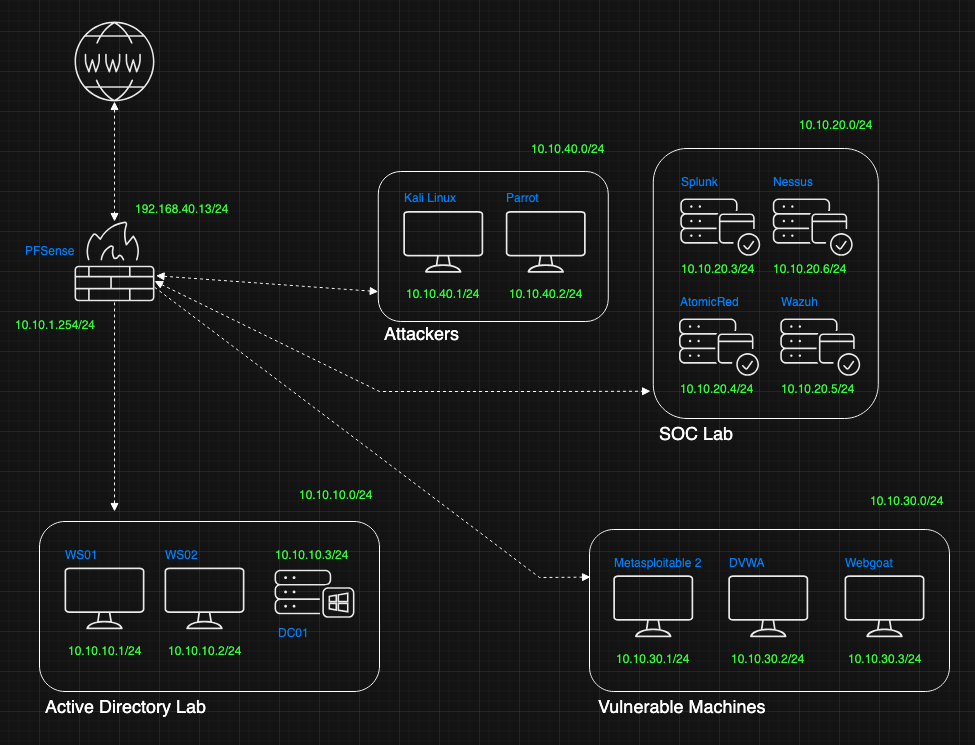
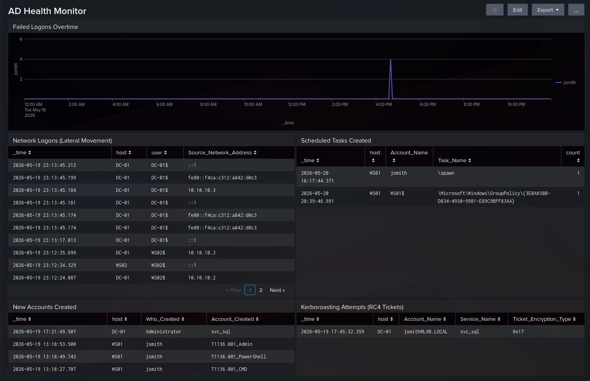

# Soc Analyst Home Lab

A hands-on cybersecurity detection lab built to develop real-world SOC analyst skills through attack simulation and SIEM-based threat hunting.

## Project Overview

This repository documents my journey building a home cybersecurity detection lab from scratch. The lab simulates a complete enterprise environment with Active Directory, vulnerable machines, and a full SIEM stack for detecting real attacks.

**Core Goal:** Learn to detect real-world attack techniques mapped to the MITRE ATT&CK framework using Splunk, Sysmon, and Atomic Red Team.

## Lab Architecture

### Network Segments

| Segment | Subnet | Purpose | Hosts |
|---------|--------|---------|-------|
| **Active Directory Lab** | 10.10.10.0/24 | Primary victim network | WS01, WS02, DC01 |
| **SOC Lab** | 10.10.20.0/24 | Detection & analysis tools | Splunk, Nessus, Wazuh |
| **Vulnerable Machines** | 10.10.30.0/24 | Exploitation targets | Metasploitable 2, DVWA, WebGoat |
| **Attackers** | 10.10.40.0/24 | Offensive platforms | Kali Linux, Parrot OS |

## Current Capabilities

### Detections Implemented (Week 3)

✅ **Brute Force Attacks** — EventCode 4625, Sub_Status analysis  
✅ **Account Creation & Privilege Escalation** — EventCode 4720 + 4732 correlation  
✅ **Kerberoasting** — EventCode 4769 with RC4 encryption detection  
✅ **Lateral Movement** — EventCode 4624 Logon_Type=3 analysis  
✅ **Scheduled Task Persistence** — EventCode 4698 detection  

### Active Dashboard
**AD Health Monitor** — 5-panel Splunk dashboard tracking:

- Failed logons overtime
- Network logons (lateral movement)
- New accounts created
- Kerberoasting attempts (RC4 tickets)
- Scheduled tasks created

## Tech Stack

| Category | Tools |
|----------|-------|
| **SIEM** | Splunk Enterprise |
| **Endpoint Detection** | Sysmon, Wazuh |
| **Attack Simulation** | Atomic Red Team |
| **Vulnerability Scanning** | Nessus |
| **Exploitation** | Metasploit, Kali/Parrot OS |
| **Virtualization** | Proxmox |
| **Operating Systems** | Windows Server 2022, Windows 10, Ubuntu, Kali |

## Documentation Structure

This repository contains three core documents:

1. **[Lab_Context.md](docs/Doc1_Lab_Context.md)** — Lab architecture, VM inventory, network topology
2. **[Curriculum_Tracker.md](docs/Doc2_Curriculum_Tracker.md)** — Weekly progress, session logs, learning objectives
3. **[Cheat_Sheet.md](docs/Doc3_Cheat_Sheet.md)** — Event ID reference, SPL queries, detection techniques, notes

## 8-Week Curriculum

| Week | Topic | Status | Key Achievements |
|------|-------|--------|------------------|
| 1 | [Lab setup & Splunk fundamentals](week1.md) | ✅ Complete | Configured forwarders, resolved log routing, installed Sysmon |
| 2 | [Windows event log analysis](week2.md) | ✅ Complete | Built detection queries, configured GPO audit policies, created alerts |
| 3 | [Active Directory Attack Detection](week3.md)  | ✅ Complete | Detected Kerberoasting, lateral movement, persistence, built 5-panel dashboard |
| 4 | Linux syslog & auditd | 🔜 Next | — |
| 5 | Network Detection (PFSense, DNS) | ⏳ Planned | — |
| 6 | Threat Hunting with MITRE ATT&CK | ⏳ Planned | — |
| 7 | SIEM Alerting & Correlation Rules | ⏳ Planned | — |
| 8 | Capstone: Full Attack Chain Detection | ⏳ Planned | — |

## MITRE ATT&CK Coverage

| Technique ID | Technique Name | Tactic |
|--------------|----------------|--------|
| T1110.001 | Brute Force | Credential Access |
| T1136.001 | Create Local Account | Persistence |
| T1558.003 | Kerberoasting | Credential Access |
| T1021.002 | SMB Lateral Movement | Lateral Movement |
| T1053.005 | Scheduled Task | Persistence |
| T1059.001 | PowerShell | Execution |

## Progress Metrics

**Total Lab Hours:** ~17 hours  
**Detection Queries Built:** 12  
**Techniques Detected:** 6  
**Dashboard Panels:** 5  
**Confidence Level:** 5/10

## Getting Started

### Prerequisites
- Proxmox (or equivalent hypervisor)
- Windows Server 2022 ISO
- Windows 11 ISO
- Kali Linux ISO
- 96GB+ RAM recommended
- 500GB+ storage

### Quick Start
1. Review [Lab Architecture](docs/Doc1_Lab_Context.md) for network design
2. Follow [Week 1 Setup](docs/Doc2_Curriculum_Tracker.md#week-1-detail--completed-) for initial configuration
3. Reference [Detection Queries](docs/Doc3_Cheat_Sheet.md#42-detection-queries) for Splunk searches

## Key Learnings

### Technical Skills Gained
- Splunk administration and SPL query development
- Windows event log forensics and analysis
- Group Policy configuration for security auditing
- Sysmon deployment and log enrichment
- Active Directory attack detection
- MITRE ATT&CK framework mapping

### Critical Insights
- **Audit policies must be enabled** before logs appear (learned via EventCode 4720, 4698)
- **Field name accuracy matters** in Splunk dashboards (typos break visualizations)
- **Some detections require advanced configuration** (e.g., LSASS access needs Sysmon EventCode 10)
- **Correlation queries are powerful** for detecting multi-stage attacks (4720→4732)

## Troubleshooting Reference

Common issues I encountered and resolved:

| Issue | Root Cause | Solution |
|-------|------------|----------|
| Sysmon errorCode=5 | Permission issue | `sc config SplunkForwarder obj= LocalSystem` |
| Event 4698 not appearing | Audit policy not enabled | Enable "Audit Other Object Access Events" via GPO |
| LSASS dump no telemetry | Sysmon EventCode 10 not configured | Requires advanced Sysmon config (deferred to Week 6) |

## Future Enhancements

- [ ] Configure Wazuh integration with Splunk
- [ ] Add Linux attack detection (Week 4)
- [ ] Network traffic analysis with PFSense logs (Week 5)
- [ ] Advanced Sysmon configuration for process access monitoring
- [ ] Multi-stage correlation alerting
- [ ] Threat hunting dashboards